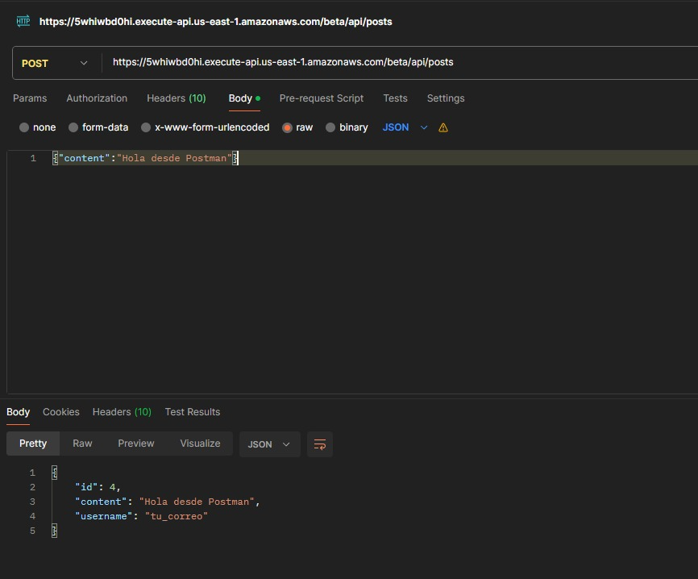
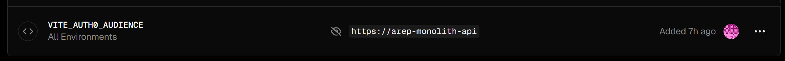

# Microservicios Lambda

Esta carpeta contiene exactamente 3 microservicios en Java implementados como funciones AWS Lambda:

- `user-service` (`UserLambdaHandler`)
- `posts-service` (`PostsLambdaHandler`)
- `stream-service` (`StreamLambdaHandler`)

Este proyecto se puede desplegar de dos formas:

- Forma manual (recomendada para flujo de clase): crear cada Lambda en AWS Console y subir el jar.
- Forma SAM (opcional): usar `template.yaml` para automatizar la infraestructura.

## Endpoints

- `POST /api/users`
- `PUT /api/users/username`
- `GET /api/me`
- `POST /api/posts`
- `GET /api/feed/public`

## Compilacion por servicio

```powershell
cd user-service
..\..\monolith\mvnw.cmd -DskipTests package
```

```powershell
cd posts-service
..\..\monolith\mvnw.cmd -DskipTests package
```

```powershell
cd stream-service
..\..\monolith\mvnw.cmd -DskipTests package
```

Jars generados:

- `user-service/target/user-service-lambda.jar`
- `posts-service/target/posts-service-lambda.jar`
- `stream-service/target/stream-service-lambda.jar`

## Bitacora de despliegue en AWS (API Gateway + Lambda)

En esta fase del proyecto, desplegamos el backend de microservicios en AWS usando una funcion Lambda por servicio y API Gateway como punto de entrada.

Primero creamos las tres funciones Lambda en AWS Console, una para cada servicio del dominio:

- Servicio User
- Servicio Posts
- Servicio Stream

Configuramos cada Lambda con los siguientes parametros:

- Runtime: Java 17
- Tipo de carga: .zip o .jar
- Handler (User): `edu.escuelaing.arep.userservice.lambda.UserLambdaHandler::handleRequest`
- Handler (Posts): `edu.escuelaing.arep.postsservice.lambda.PostsLambdaHandler::handleRequest`
- Handler (Stream): `edu.escuelaing.arep.streamservice.lambda.StreamLambdaHandler::handleRequest`

Luego configuramos las variables de entorno en cada Lambda:

- `AUTH0_DOMAIN`
- `AUTH0_AUDIENCE`
- `DB_URL`
- `DB_USERNAME`
- `DB_PASSWORD`
- `CORS_ALLOWED_ORIGIN`

Despues creamos un API Gateway (HTTP API o REST API) y mapeamos cada ruta HTTP a su correspondiente funcion Lambda:

- `POST /api/users` -> User Lambda
- `PUT /api/users/username` -> User Lambda
- `GET /api/me` -> User Lambda
- `POST /api/posts` -> Posts Lambda
- `GET /api/feed/public` -> Stream Lambda

Finalmente, habilitamos CORS en API Gateway para el origen del frontend, configuramos los permisos de invocacion de Lambda, y validamos que la URL de invocacion del API Gateway fuera la correcta para usar como `VITE_API_URL` en el frontend.

### Evidencia (pantallazos)

Pantallazo 1 - Lambda User (configuracion de handler clase::funcion)

![[Espacio para imagen]](assets/userHandler.png)

Pantallazo 2 - Lambda Posts (configuracion de handler clase::funcion)

![[Espacio para imagen]](assets/postHandler.png)

Pantallazo 3 - Lambda Stream (configuracion de handler clase::funcion)

![[Espacio para imagen]](assets/streamHandler.png)

Pantallazo 4 - API Gateway (rutas integradas con Lambdas)

![[Espacio para imagen]](assets/API.png)

Pantallazo 5 - Frontend consumiendo la API y validacion




